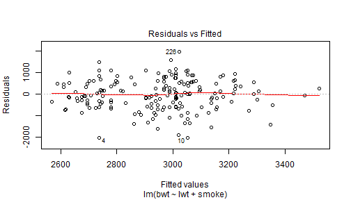

A Linear Regression Model for Infant Birth Weight
========================================================
transition: fade
author: Mark K.
date:   3.14.15

Introduction
========================================================  
transition: fade

- Low birth weight is associated with mortality, reduced growth and cognitive development, and chronic disease in adult life ([see.](https://en.wikipedia.org/wiki/Low_birth_weight))  

- The CDC [reports](http://www.cdc.gov/nchs/fastats/birthweight.htm) **8.0%** of infants born in **2013** were of low birth weight (weight less than 2.5 kg.)  

- I created a shiny app that uses the [birthwt](https://stat.ethz.ch/R-manual/R-patched/library/MASS/html/birthwt.html) data set in the MASS package to examine linear models of risk factors for low birth weight.

Risk Factors for Low Birth Weight
========================================================
transition: fade
For this project I decided to focus on five risk factors that might explain low birth weight (bwt: kg.)

- Mother's age (age)
- Mother's weight at last menstrual period (lwt: lbs)
- Mother's race (race: white, black, other) 
- Smoking status during pregnancy (smoke: yes, no)
- History of hypertension (ht: yes, no)  
  
You can create different models with combinations of these risk factors using my [app.](https://mark-ko.shinyapps.io/myApp/
)
  
  
Results
========================================================
transition: fade
The models showed some statistically significant linear regression coefficients, for example: 

```
              Estimate Pr(>|t|)
(Intercept) 2501.12536  0.00000
lwt            4.23674  0.01303
smoke       -272.08115  0.01075
```
But, the adjusted R-squared values were low for this particular model: 

```
[1] 0.058
```

  
Conclusion  
=========================================================  
transition:fade
type:alert
<small>Combinations of the covariates will produce linear regression coefficients with low p-values, but the models have low adjusted R-squared. This is likely due to the variability in the covariates.</small>  
 
  
<small>These simple linear models show risk factors, but are **not adequate for prediction.** There could be interactions between risk factors not modeled, or important risk factors may not be included in the data set.</small>

